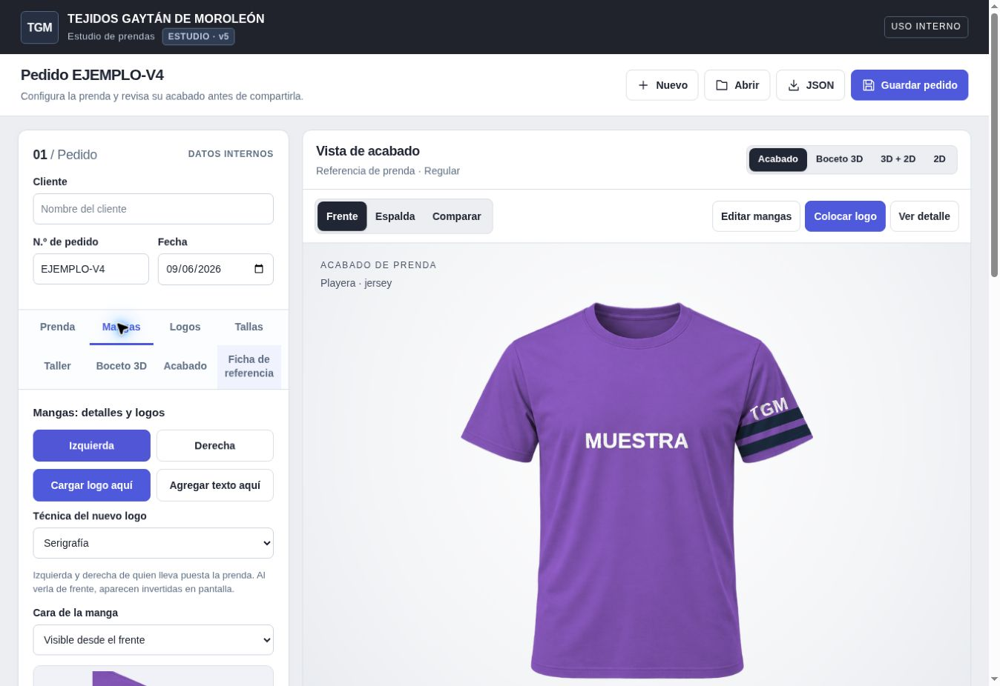

# TGM — Garment Order Studio v5

An offline internal order and finished-look preview app for Tejidos Gaytán de Moroleón. The app, reference sheets, exports, and staff guide are in Spanish. No accounts, backend, storefront, network connection, or installation is needed.



## Repository quick start

This repository is intended to be **private**. It contains app code, generated garment bases, documentation and generic preview images. Saved client pedidos and uploaded artwork stay in the browser or in separately downloaded JSON backups; they are not part of this repository.

Download the repository ZIP, extract it, and open **dist/index.html** in a desktop browser. This is the same standalone v5 app delivered as TGM_Pedidos.html. No install or build is required to run the committed app. Mobile layouts and touch controls are included, but physical iPhone/Android uploads, storage and exports still need device testing.

To rebuild after editing source, use Python 3 (standard library only):

```sh
python3 photostudio/build.py
```

With Node.js installed, the equivalent is `npm run build`. The optional local preview command is `npm run dev`; it serves the app on port 4173 and binds to this computer by default. It does not publish the site.

Edit the files in `photostudio/` and regenerate `dist/index.html`; keep both source and generated HTML in the same commit. `photostudio/order-v4/` contains the logo, technique and ficha extension; `photostudio/sleeves-v5/` contains the dedicated sleeve workflow. `photostudio/v2-reference.html` is the retained baseline used by the build. The root `studio3d.js` is an earlier sketch reference, not a separate runtime dependency.

The repository provides version history and code collaboration. It does not create a hosted app, share browser storage, invite coworkers or enable GitHub Pages. Hosting and shared order storage are separate steps. No open-source license has been added.

## Standalone delivery

Download **TGM_Pedidos.html** and open the actual file in your browser. All code and garment images are embedded. Keep a JSON backup before moving to a newer app file: browsers may isolate storage by local file, browser, and device. Use **Abrir → Importar archivo JSON** to load earlier orders.

The ZIP includes the standalone app, source, 10-line staff guide, actual browser screenshots, and a generic sample pedido with internal/client PDFs. Examples are labeled EJEMPLO and contain no factory production quantities or supplied client documents. New pedidos start without example artwork.

## Sleeves — new in v5

Open **Mangas → Izquierda / Derecha → Cargar logo aquí**. The same panel is reachable through **Editar mangas** above the preview or **Ir a Mangas** in Logos. Left/right always means the person wearing the garment; the screen position reverses between front and back.

Each sleeve independently supports a color, contrast edge, one stripe or two stripes, visual thickness, optional requested width in centimeters and construction notes. Copy its details to the other sleeve when needed. Colors and bands wrap into both front/back references; image/text applications belong to the selected front or back view. Add the reverse view separately if the client wants it. This works on playera, hoodie and polo bases.

**Cargar logo aquí** preserves PNG/SVG/JPG artwork using the existing cleanup workflow. **Agregar texto aquí** creates text in the selected sleeve zone. Choose Serigrafía, Bordado or Sublimado, then position, scale and rotate it in Logos. Artwork is clipped to the selected sleeve region. **Reutilizar una aplicación del pedido** copies a logo without another upload; physical dimensions and machine-specific fields are cleared for confirmation at the new position.

The sleeve close-up, **Ampliar manga** and **PNG de manga** help inspect the result. The close-up uses the chosen front/back view; it is not a separate side photograph or 3D turntable. Sleeve PNG is 1600 × 1300 with an approximate-placement label. A loaded final render is inspected as a complete image instead. The older 2D and Boceto 3D workspaces do not display independent sleeve colors/bands; use Acabado for these details.

Sleeve configuration, original artwork and per-view placement are retained in the full pedido/JSON. Client PDFs show sleeve colors/bands and application zones. The internal ficha also includes optional sleeve construction notes and requested dimensions. Private notes stay out of client summaries. Blank measurement fields mean not yet defined; visual thickness is not calibrated to centimeters.

## Logos and technique

Open **Logos → Cargar logo del cliente** for PNG, SVG or JPG, up to 5 MB. Up to 12 applications each retain their original file, prepared image, technique and placement. Solid text is also supported.

**Preparar logo** offers percentage-based cropping, removal of light backgrounds connected to the image border, optional removal of interior whites, transparent-margin trimming, and one-color conversion. Preparation always starts from the preserved original and is reversible. Compare original/applied thumbnails or download either. This is image cleanup; it does not trace vectors or invent missing detail.

Localized applications can be dragged or positioned with numeric controls on the front/back, chest, sleeves or hem. Arrow keys move the selected design; Shift moves it farther. Width/height in centimeters and measured placement instructions are stored specifications; the generic photo is not calibrated in centimeters. Effective image resolution is advisory.

| Technique | Preview | Workshop information |
| --- | --- | --- |
| Bordado | Approximate thread and raised edges | Stitch count, machine format/dimensions, color changes, stops, trims, thread/bobbin usage, needle/color sequence, stabilizer, punch status and machine-file reference |
| Serigrafía | Approximate opaque ink | Ink/finish, white underbase, screens/stencils, mesh and registration, color sequence, squeegee, drying and curing notes |
| Sublimado | Approximate color integrated with fabric shading | Localized artwork or full garment pieces, source layout, transfer mirror request, bleed/seam allowance, sheet arrangement and transfer notes |

For a sublimation layout, upload the sheet, crop a piece, and assign **Panel de cuerpo completo**, **Manga izquierda**, **Manga derecha**, or **Cuello / capucha**, with the correct front/back view. Duplicate the application to reuse its original sheet for another crop. Coverage uses approximate photo masks. It does not generate a cutting pattern, calibrated print layout, seam matching or transfer-ready artwork. The mirror option records a request; the finished-garment preview stays readable and is not mirrored automatically.

The app follows the requested **factory rule of 100% polyester for sublimation**. Client exports involving sublimation remain blocked until composition is recorded as 100% polyester. Internal development sheets may retain unresolved specifications. This is a factory workflow rule, not a universal claim that all polyester blends are unsuitable. Materials and process still need workshop testing.

No stitch counts, production times, costs or machine settings are generated. Optional handoff fields are labeled EJEMPLO and remain blank until entered. The app does not digitize embroidery, generate DST/EMB, create production screen separations, run a RIP or automate transfers.

## Full ficha and saved pedido

**Ficha de referencia** records client request, style/revision/status, fabric composition/references, pattern, fit, construction/notions/labels, optional S–XXL measurements and tolerance, sample requirements, owner, target date and development notes. It includes the garment, size-run, care, packaging, QC, minutes and internal-note data.

Attach up to eight original references, each up to 5 MB: PDF, PNG/JPG, DST or EMB. Select the technique and add a note. PDF and machine files are retained without automatic extraction or interpretation. Image references appear in the internal PDF; other originals are listed there and fully embedded in the JSON backup.

**Revisar ficha completa** opens the paginated report. **PDF de ficha interna** exports the **FICHA DE REFERENCIA PARA COTIZACIÓN Y DESARROLLO DE MUESTRA** with mockups, original/applied artwork and entered specifications. It grows as needed so details are not cut off to fit one page. Pages are images; PDF text is not searchable.

**Guardar pedido** saves the full record; the draft also saves automatically. IndexedDB is primary storage, with localStorage fallback. Saving waits for storage completion and reports failures. **JSON** backs up all ficha data, original/prepared artwork, references and completed renders. Version 5 imports versions 1–5 and reads accessible older storage without overwriting it. Large records depend on available browser quota; keep downloaded backups.

## Realistic reference and client exports

**Acabado** is the default Canvas 2D preview: front, back, comparison and 1–4× detail inspection. Playera, hoodie and polo have fixed AI-generated bases with folds, seams and textile grain. Recoloring and application effects retain the shading. The app makes no AI or network calls.

Source sheets are 1536 × 1024; an individual garment occupies roughly 700–850 pixels across/tall. PNG exports are 2000 × 2300 and resampled. Zoom adds no source detail. Texture, contrast masks, artwork displacement, thread relief and piece coverage are explicitly approximate.

| Base | Neck | Cuff | Hem | Details |
| --- | --- | --- | --- | --- |
| Playera | Crew neck | Simple | Double stitched | Short sleeves |
| Hoodie | Hood | Ribbed | Ribbed | Drawstrings and kangaroo pocket |
| Polo | Polo collar/buttons | Ribbed | Double stitched | Short sleeves |

Incompatible construction stays in the pedido and shows a mismatch notice. Client export from the base is blocked until the configuration matches or staff provides corresponding finished renders. Imported front/back renders must already include final color and applications; further logos are not overlaid. Visual changes mark them as needing an update. The earlier **Boceto 3D** and **2D** workspaces remain available; they do not provide cloth simulation or calibrated fit.

The client export remains **PDF · 1 página**, plus **PNG frente**, **PNG espalda**, print and a lowercase Spanish caption. These omit internal client name, workshop notes, minutes, QC and source filenames. Full reference PDFs and JSON contain internal information. Review text inside uploaded images before sharing. The app copies and downloads; it does not send messages.

## Ranked next features

1. **Professional 3D turntable:** draped garment assets, calibrated materials, improved lighting and artwork aligned across views.
2. **Pants and shorts:** dedicated bases, construction options and application zones.
3. **Past-order catalog:** thumbnails, search, reusable templates and controlled duplication.
4. **WhatsApp Business sending:** an explicitly connected sending workflow with recipient and attachment review.
5. **Link a production lote later:** a separately authorized integration, independent of live dyehouse dashboards.

## Source and validation

Vanilla HTML/CSS/JavaScript, Canvas 2D and an optional WebGL sketch. No CDN, Firebase, backend or dashboard integration. Schema: tgm-pedido, version 5. Fallback prefix: tgm-estudio-v5. IndexedDB database: tgm-pedidos-local.

In this repository, run `python3 photostudio/build.py` to produce dist/index.html. In the earlier standalone delivery ZIP, the same source directory is named `source`, so its command is `python3 source/build.py`. Source includes the retained v2 baseline, photo compositor, generated assets/prompt record, order-v4 modules and the sleeves-v5 extension. Optionally run `npm run dev` afterward for the dependency-free Node preview server. Opening the committed dist/index.html or the standalone TGM_Pedidos.html requires none of those steps.

See VALIDATION.md for completed checks and remaining browser-upload, download and physical-device limits.
